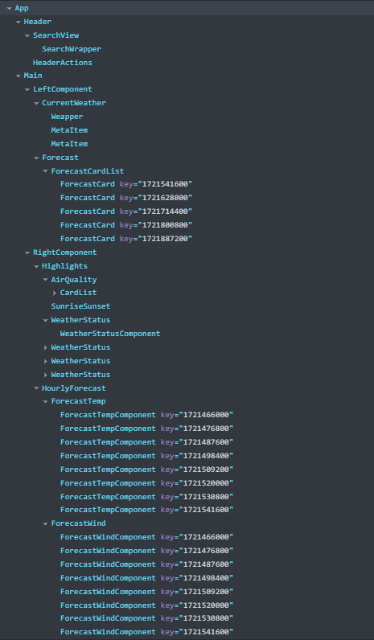

# Sumary

This project is the home assignment for applying as an **Intern Frontend Developer**.

## Tech Stack:

- For the frontend, I am using ReactJS to build a fully Responsive website.
- For the data, I use API key from https://openweathermap.org/api to fetch the data and with the help of Postman, I can get the required information for illustration.
- For web deployment, I use Vercel to display the web contents and features.
- Here is the link [Weather report - Check out what's in the sky above!](https://weather-report-b93lmx88r-chaus-projects-8bdd6df0.vercel.app)

## Techniques:

## Detail Design

### 1. Requirement:
Build a Responsive Weather report system that shows the basic Weather status, air quality, and the time of sunrise/sunset.
We want to track the following statistic such as:
- Types of weather (Sunny, Cloudy, Rain, etc)
- Temperature (°C)
- Air quality (Humidity, Pressure, Visibility, Feels like)
- Current weather of different moments of the day.
- The weather status of the next 5 days.
- The input value where the User can enter the city name to display the staus of that area.

### 2. Component Designs
    ComponentStructure.png

# Sumary

This project is the home assignment for applying as an **Intern Frontend Developer**.

## Tech Stack:

- For the frontend, I am using ReactJS to build a fully Responsive website.
- For the data, I use API key from https://openweathermap.org/api to fetch the data and with the help of Postman, I can get the required information for illustration.
- For web deployment, I use Vercel to display the web contents and features.
- Here is the link https://weather-report-b93lmx88r-chaus-projects-8bdd6df0.vercel.app/

## Techniques:

## Detail Design

### 1. Requirement:
Build a Responsive Weather report system that shows the basic Weather status, air quality, and the time of sunrise/sunset.
We want to track the following statistic such as:
- Types of weather (Sunny, Cloudy, Rain, etc)
- Temperature (°C)
- Air quality (Humidity, Pressure, Visibility, Feels like)
- Current weather of different moments of the day.
- The weather status of the next 5 days.
- The input value where the User can enter the city name to display the staus of that area.

### 2. Component Structure
Here is the component structure of the website i made.
</img>
