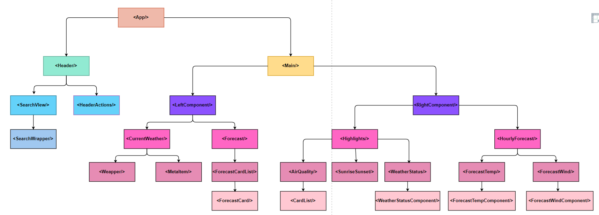

# Sumary

Hi, my name is Nguyen Huu Chau.

And this is my side project link [Weather Report - Check out what's in the sky above!](https://weather-report-lemon-eta.vercel.app/)

## Tech Stack:

- For the frontend, I am using ReactJS along with Bootstrap CSS to build a fully Responsive website.
- For the data, I use API key from https://openweathermap.org/api to fetch the data and with the help of Postman, I can get the required information for illustration.
- For web deployment, I use Vercel to display the web contents and features.

## Detail Design

### 1. Requirement:
In order to build a Responsive Weather report system that shows the basic Weather status, air quality, and the time of sunrise/sunset.

We want to track the following statistic such as:
- Types of weather (Sunny, Cloudy, Rain, etc)
- Temperature (°C)
- Air quality (Humidity, Pressure, Visibility, Feels like)
- Current weather of different moments of the day.
- The weather status of the next 5 days.
- The input value where the User can enter the city name to display the staus of that area.

### 2. Component Structure
Here is the component structure of the website i made.

</img>

## What I learned:

  From building the Weather report website, I got to have a large ammount of understanding about React and its concept, along with the basic principle of creating and deploying a website on the internet.

- Deep learning about **Components** and **Component interactions**.
- Understand the **State** concept (`state`, `setState`, `...prevState`, etc)
- Know how to **destructure an object state** and pass it to the **Parent** or **Child** component.
- Basic understanding of **callbacks, promises and async awaits** to fetch the data, change the parameter input and `useEffect()`.
- Learn the **flows of the website** so as to **handle the error** more **efficiency**.
- Learn how to **fetch data and store it in a state** to perform tasks (use it as a parameter to fetch the data required, use the state value to display the content of the website)
- Learn the functionality of **package.json**, **.gitignore** and **.env**
- Understand the **git commads** such as ```git add .```, ```git pull```, ```git commit```, ```git remote``` and ```git push``` to push the code into github, along with ```git clone``` to get the code from github.

## Future updates:

  This website has all the basic requirement of a Weather Report website.

  Which is why there are many updates I want to make onto the project, such as

- Adding animation such as the animation of the current weather (sunny, rain) in the background for better User experience
- Adding searching feature that zoning the closest input value and diplay it into a drop down list. This will require an understanding of backend coding. Which is why I have plans to learn Nodejs to make it happen.
- Change the "Submit Location" button into "Current Location" as we will click directly on the drop list to display that city's weather status
- Adding features to convert the tempreture from °C to °F, as well as convering km/h into mph/h
- Create a navigation bar with Home that display the content of the website and Saved city that store the city's weather status you saved and display it on the Home page.
- I have plans of learning React Native in order to deploy a true app, not just a website.
- In the app, i want to display the data of the area the user is standing. This will require google maps api and I will updates this feature after finishing React Native.
